[English](README.md) | العربية

---

# 🚚 تحليل بيانات سلسلة التوريد والشحن

---

## 📑 جدول المحتويات

- [نظرة عامة على المشروع](#-نظرة-عامة-على-المشروع)
- [المشكلة والأهداف](#-المشكلة-والأهداف)
- [الأدوات ومراحل العمل](#️-الأدوات-ومراحل-العمل)
  - [الأدوات والتقنيات](#1-الأدوات-والتقنيات)
  - [مراحل العمل من البداية للنهاية](#2-مراحل-العمل-من-البداية-للنهاية)
  - [تحليل SQL](#️-تحليل-sql)
  - [لوحة Excel](#-لوحة-excel)
- [أهم النتائج والرؤى](#-أهم-النتائج-والرؤى)
- [ملاحظات جودة البيانات](#-ملاحظات-جودة-البيانات)
- [هيكل المشروع](#-هيكل-المشروع)
- [إزاي تشغل المشروع](#-إزاي-تشغل-المشروع)
- [تواصل معايا](#-تواصل-معايا)

---

## 📌 نظرة عامة على المشروع

> *الملف ده اتعمل بمساعدة الذكاء الاصطناعي، بتوجيه ومراجعة مني.*

المشروع ده بيقدم تحليل بيانات كامل لعمليات الشحن والتوصيل، بيستكشف أنماط التأخير وأسبابه وتوزيع التكاليف عبر الأقاليم وشركات الشحن والأحوال الجوية المختلفة. بيحول بيانات الشحن الخام لرؤى عملية تدعم القرارات التشغيلية في إدارة سلاسل التوريد.

---

## 🎯 المشكلة والأهداف

### 1. السياق العام

شركات اللوجستيات بتواجه ضغطاً مستمراً لتقليل التأخيرات والتحكم في التكاليف والحفاظ على رضا العملاء. من غير رؤية تحليلية موحدة لأداء التوصيل عبر الشركاء والأقاليم والظروف المختلفة، صعب تحديد أين بتحصل مشاكل الكفاءة وإزاي تتعالج.

### 2. أهداف المشروع

التحليل ده بيجاوب على أسئلة عمل أساسية على مستويين:

- **أسئلة عامة:**
  - قياس إجمالي حجم الشحنات ونسبة التأخير.
  - تقييم متوسط تكلفة التوصيل وتقييم العملاء.
  - فهم توزيع الشحنات على الأقاليم وحالات التوصيل المختلفة.
  - حساب متوسط مسافة الشحن ووزن الطرود.

- **أسئلة متوسطة الصعوبة:**
  - هل الأحوال الجوية بتأثر على احتمالية تأخر الشحنة؟
  - إيه مجموعة شركة الشحن ونوع المركبة اللي عندها أعلى نسبة تأخير؟
  - هل فيه علاقة بين طريقة التوصيل ومتوسط تقييم العملاء؟
  - هل المسافات الأطول بتؤدي لتكاليف توصيل أعلى؟

---

## 🛠️ الأدوات ومراحل العمل

### 1. الأدوات والتقنيات

- **مصدر البيانات:** Kaggle (داتا ست Supply Chain & Shipment Deliveries - صيغة CSV)
- **استكشاف وتنظيف البيانات:** Microsoft Excel
- **إدارة واستعلام قاعدة البيانات:** SQL (PostgreSQL)
- **التصور البصري:** Excel (Pivot Tables & Dashboard)
- **إدارة الإصدارات:** Git & GitHub

### 2. مراحل العمل من البداية للنهاية

`[ملف CSV الخام (Kaggle)]` ➡️ `[Excel (تنظيف البيانات والتأكد من أنواعها)]` ➡️ `[قاعدة بيانات SQL (إنشاء الجدول والاستعلامات)]` ➡️ `[Excel Pivot Tables & Dashboard]`

- **الخطوة 1: استكشاف وتنظيف البيانات (Excel)**
  - تحميل ملف الـ CSV الخام في Excel للتأكد من صحة أنواع البيانات قبل أي معالجة تانية.

- **الخطوة 2: إنشاء قاعدة البيانات وتنفيذ الاستعلامات (SQL)**
  - إنشاء الجدول باستخدام `row_id SERIAL PRIMARY KEY` بدل عمود `delivery_id` الأصلي اللي كان فيه قيم مكررة وأرقام عشرية — مشكلة جودة بيانات اتحددت أثناء الاستكشاف.
  - كتابة استعلامات SQL للإجابة على كل سؤال عمل في المستويين.

- **الخطوة 3: بناء اللوحة (Excel)**
  - إعادة بناء التحليل بصريًا باستخدام Pivot Tables و Pivot Charts، مع فلاتر (Slicers) لشركة الشحن والإقليم وطريقة التوصيل.

---

### 🗄️ تحليل SQL

[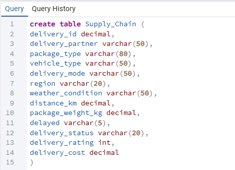](Images/Create_Table.png)
*تصميم هيكل الجدول في SQL. تم استخدام `row_id SERIAL PRIMARY KEY` بدل `delivery_id` بسبب وجود قيم مكررة وأرقام عشرية في العمود الأصلي.*

[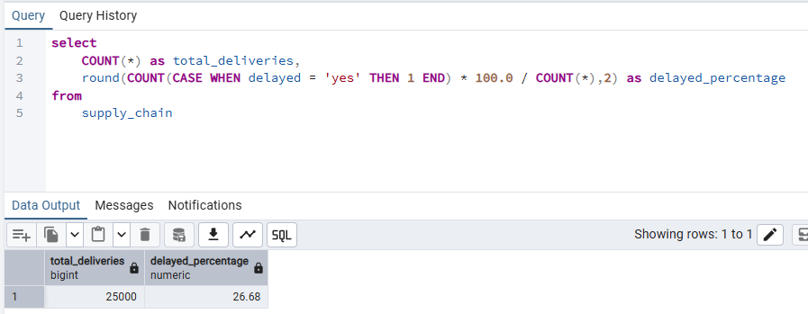](Images/total_deliveries_delayed_percentage.png)
*حساب إجمالي عدد الشحنات (25,000) ونسبة التأخير الإجمالية (26.68%) — تقريباً 1 من كل 4 شحنات بتتأخر.*

[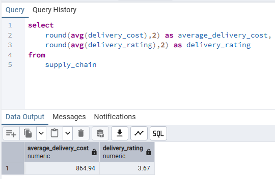](Images/avg_delivery_cost_rating.png)
*حساب متوسط تكلفة التوصيل (864.94) ومتوسط تقييم العملاء (3.67 من 5) عبر كل الشحنات.*

[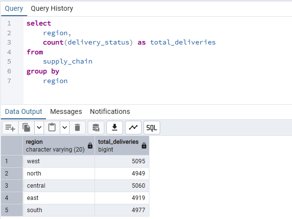](Images/deliveries_by_region.png)
*تجميع الشحنات حسب الإقليم، وظهور توزيع متوازن بحوالي 5,000 شحنة لكل إقليم — مما يضمن مقارنات إحصائية عادلة.*

[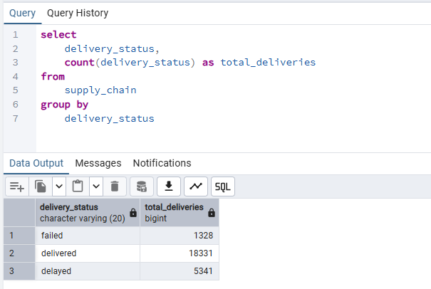](Images/deliveries_by_status.png)
*تقسيم الشحنات حسب الحالة: 18,331 تم توصيلها، 5,341 متأخرة، و1,328 فاشلة.*

[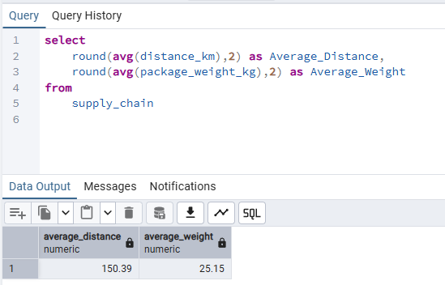](Images/avg_distance_weight.png)
*حساب متوسط مسافة الشحن (150.39 كم) ومتوسط وزن الطرد (25.15 كجم) عبر كل الشحنات.*

[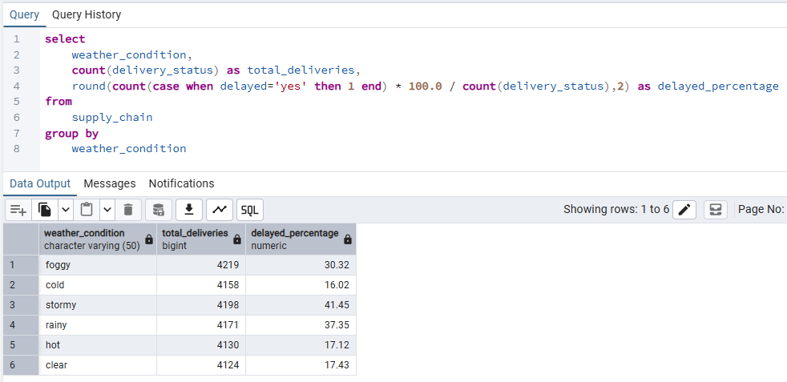](Images/weather_vs_delayed.png)
*مقارنة نسب التأخير عبر الأحوال الجوية المختلفة. الجو العاصف (41.45%) والممطر (37.35%) يظهران نسب تأخير أعلى بكتير من الجو الصافي (17.43%) أو البارد (16.02%).*

[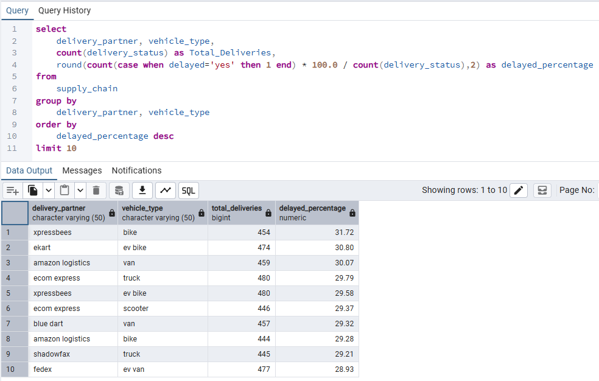](Images/delay_rate_by_partner_vehicle.png)
*تحليل نسب التأخير حسب مجموعة شركة الشحن ونوع المركبة. الملاحظة المهمة: مفيش مجموعة واحدة بتتميز بشكل واضح — الفارق بين أعلى وأدنى 10 مجموعات ضيق جداً (28.93%–31.72%)، مما يشير لأن التأخيرات مرتبطة أكتر بعوامل خارجية (جو، مسافة) مش بالشركة أو المركبة نفسها.*

[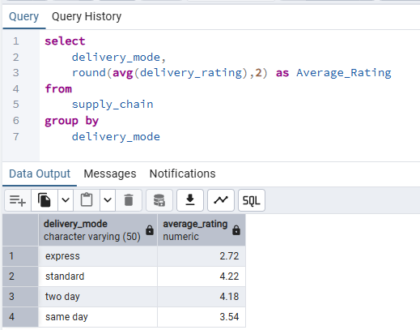](Images/delivery_mode_vs_rating.png)
*مقارنة متوسط تقييمات العملاء عبر طرق التوصيل المختلفة. التوصيل السريع (Express) حصل على أقل تقييم (2.72) رغم كونه الأسرع — على الأرجح لأن توقعات العملاء الأعلى بتضخم تأثير أي مشكلة بسيطة.*

[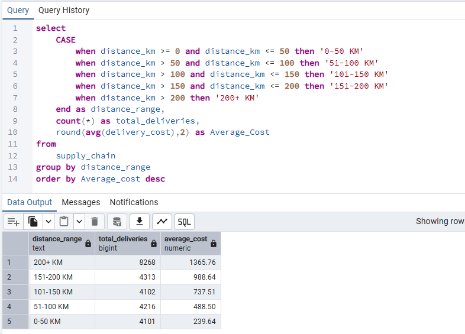](Images/distance_vs_cost.png)
*تقسيم الشحنات لفئات مسافة وحساب متوسط التكلفة لكل فئة. علاقة خطية واضحة — التكلفة بتزيد بشكل منتظم مع المسافة، من 239.64 للمسافات (0–50 كم) لحد 1,365.76 للمسافات (200+ كم).*

---

### 📊 لوحة Excel

[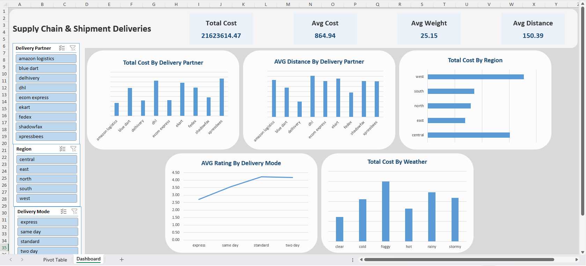](Images/Excel_Dashboard.png)
*بناء لوحة تفاعلية في Excel باستخدام Pivot Tables و Pivot Charts، مع فلاتر لشركة الشحن والإقليم وطريقة التوصيل للتصفية السريعة والتحليل المتقاطع.*

---

## 📊 أهم النتائج والرؤى

### 1. المؤشرات الأساسية

- **إجمالي الشحنات:** 25,000
- **نسبة التأخير:** 26.68% (تقريباً 1 من كل 4 شحنات)
- **متوسط تكلفة التوصيل:** 864.94
- **متوسط تقييم العملاء:** 3.67 / 5

### 2. الأحوال الجوية هي أقوى عامل في التأخير

- الجو العاصف بينتج نسبة تأخير **41.45%** مقابل **16.02%** في الجو البارد — فرق تقريباً 2.5 ضعف.
- الأحوال الجوية بتتفوق باستمرار على شركة الشحن أو نوع المركبة كعامل تنبؤ بالتأخير.

### 3. مفيش شركة أو مركبة بتتسبب في تأخيرات بشكل واضح

- أعلى 10 مجموعات من حيث التأخير كلها في نطاق ضيق (28.93%–31.72%)، مما يشير إن مفيش عامل تشغيلي واحد هو السبب الرئيسي.

### 4. مفارقة التوصيل السريع

- رغم كونه الأسرع، التوصيل Express عنده **أقل تقييم للعملاء (2.72)** — رؤية مهمة لإدارة توقعات العملاء.

### 5. المسافة بتحدد التكلفة بشكل خطي

- التكلفة بتتزايد بانتظام مع المسافة — من **239.64** (0–50 كم) لحد **1,365.76** (200+ كم).

---

## ⚠️ ملاحظات جودة البيانات

- **`delivery_id`:** العمود الأصلي كان فيه قيم مكررة وأرقام عشرية (زي 250.99)، مما جعله غير صالح كـ Primary Key. تم استخدام عمود `row_id SERIAL` بدلاً منه.
- **`delivery_time_hours` و`expected_time_hours`:** كلا العمودين كانت قيمهم أصفار بالكامل في الداتا، مما جعل الإجابة على السؤال المخطط له عن فجوة وقت التوصيل (Section 2، السؤال 5) غير ممكنة. الداتا الأصلية محفوظة في المشروع كمرجع.

---

## 📁 هيكل المشروع

```
Supply_Chain_Analysis/
│
├── SQL/
│   ├── Create_Table.sql
│   ├── total_deliveries_delayed_percentage.sql
│   ├── avg_delivery_cost_rating.sql
│   ├── deliveries_by_region.sql
│   ├── deliveries_by_status.sql
│   ├── avg_distance_weight.sql
│   ├── weather_vs_delayed.sql
│   ├── delay_rate_by_partner_vehicle.sql
│   ├── delivery_mode_vs_rating.sql
│   └── distance_vs_cost.sql
│
├── Excel/
│   └── Supply Chain.xlsx       # ملف Excel فيه Pivot Tables واللوحة
│
├── Images/                              # الصور المستخدمة في التوثيق
│   ├── Create_Table.png
│   ├── total_deliveries_delayed_percentage.png
│   └── ...
│
├── README.md                            # التوثيق بالإنجليزي
└── README.ar.md                         # التوثيق بالعربي
```

---

## 🚀 إزاي تشغل المشروع

**إعداد قاعدة البيانات:**

- افتح أي أداة SQL بتفضلها.
- شغل `SQL/Create_Table.sql` لإنشاء بنية الجدول.
- استورد ملف CSV بتاع Supply Chain داخل الجدول.
- شغل باقي الاستعلامات الموجودة في مجلد `SQL/` عشان تعيد كل تحليل.

**لوحة Excel:**

- افتح `Excel/Supply_Chain_Analysis.xlsx` باستخدام Microsoft Excel عشان تتفاعل مع Pivot Tables والفلاتر.

---

## 🤝 تواصل معايا

LinkedIn: [Esam Haraz](https://www.linkedin.com/in/esam-haraz-459925402)

GitHub: [Esam-Haraz](https://github.com/Esam-Haraz)

Email: <esamv20@gmail.com>
